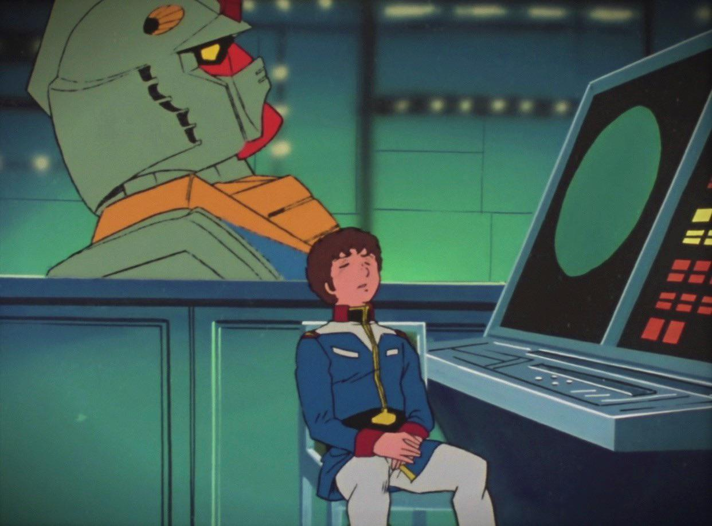

<p align="center">
  
</p>

<h1 align="center">LearningComputer</h1>

<p align="center">
  A terminal-first viewer for agent-managed tasks.<br />
  Intentionally vibe coded.
</p>

<p align="center">
  
  
  
  
</p>

<p align="center">
  <strong>LearningComputer</strong> is building toward a small but sharp task system:
  a read-only task viewer first, then a CRUD app, then something agent-pluggable and
  trend-aware later.
</p>

> [!NOTE]
> This project is intentionally vibe coded. The point is not sterile enterprise polish.
> The point is to make task state legible, fast, and fun to inspect from a terminal.

## What It Is

`LearningComputer` currently focuses on the read path:

- typed snapshot parsing for the task YAML
- file loading with timestamp and BLAKE3 reload gating
- controller-derived task views for TUI rendering
- a colorful terminal UI with multiple screens and hotkeys

The longer arc is still open-ended:

- CRUD workflows over tasks
- a pluggable database layer
- compute intelligence over patterns, trends, and task history

## Screens

| Key | View | Purpose |
| --- | --- | --- |
| `0` | Top3 | Show the current top three ranked tasks |
| `1` | P1 | Show the ordered high-priority queue |
| `2` | P2 | Show the second-priority backlog |
| `3` | P3 | Show the lower-priority/background work |
| `4` | Daily | Show recurring daily items with stale markers |
| `5` | Decisions | Show project-level decisions and operating notes |

## Controls

| Key | Action |
| --- | --- |
| <kbd>j</kbd> / <kbd>k</kbd> | Move selection |
| <kbd>↑</kbd> / <kbd>↓</kbd> | Move selection |
| <kbd>g</kbd> / <kbd>G</kbd> | Jump to first / last |
| <kbd>PgUp</kbd> / <kbd>PgDn</kbd> | Move faster |
| <kbd>d</kbd> | Toggle item detail pane |
| <kbd>r</kbd> | Manual reload + refresh |
| <kbd>q</kbd> | Clean shutdown |

## Demo Mode

If you want screenshot-safe data for the README or a quick local demo, use the bundled fixture:

```bash
cargo run -- fixtures/readme-demo.yml
```

That file is generic on purpose and does not expose live task content.

## Data Policy

No live task data is committed to this repository.

Ignored paths include:

- `tasks.yaml`
- `tasks.yml`
- `tasks.db`
- `data/tasks.yaml`

## Local Development

```bash
cargo test
```

```bash
cargo run -- fixtures/readme-demo.yml
```

<details>
<summary><strong>Architecture Notes</strong></summary>

<br />

The repo is split by responsibility:

- `model` owns the typed snapshot schema
- `loader` owns path validation, file reads, timestamps, and checksums
- `controller` owns ordered projections and selection/reload logic
- `ui` renders borrowed controller data into the TUI

The UI is intentionally kept dumb. Sorting, stale detection, top-three derivation, and reload
continuity all happen before the render layer sees the data.

</details>

<details>
<summary><strong>Where This Is Headed</strong></summary>

<br />

The future version is not fully specified yet, but the rough direction is:

1. keep the read-only viewer strong and fast
2. add safe CRUD paths
3. support a real local database
4. make the system agent plug-and-play ready
5. surface trends, patterns, and task history in a way that feels computationally useful

</details>
